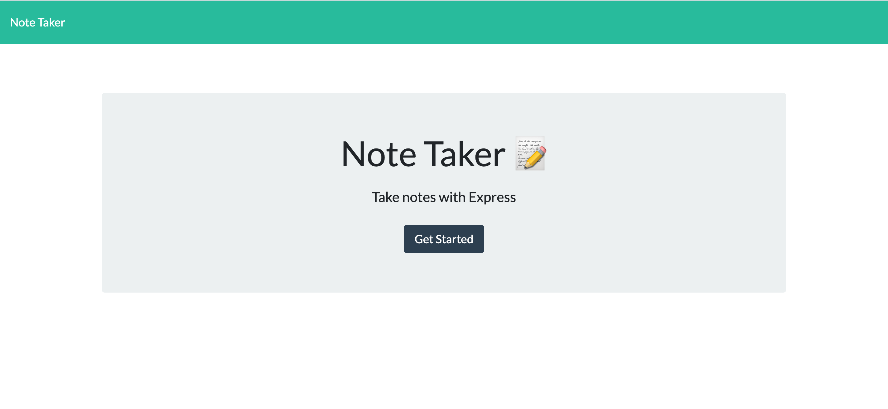
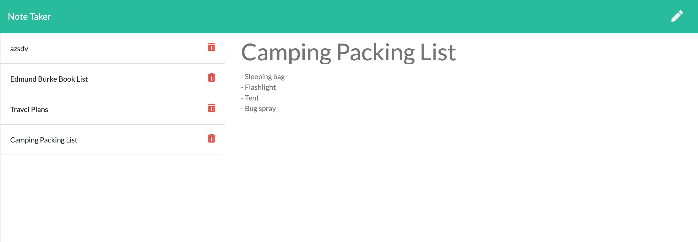

# Note-Taker
This homework assignment consisted of creating the backend for a note-taking application whose frontend was provided using Express. 

The save button at the top right writes the note's title and text to a JSON file which can be retrieved by click on the note on the left. Clicking on a note's delete button will delete the note from the JSON file. 

## Deployed Site
[Here is the link](https://rocky-ocean-61458.herokuapp.com/) to the deployed site on Heroku.

## Images
#1:

#2:

